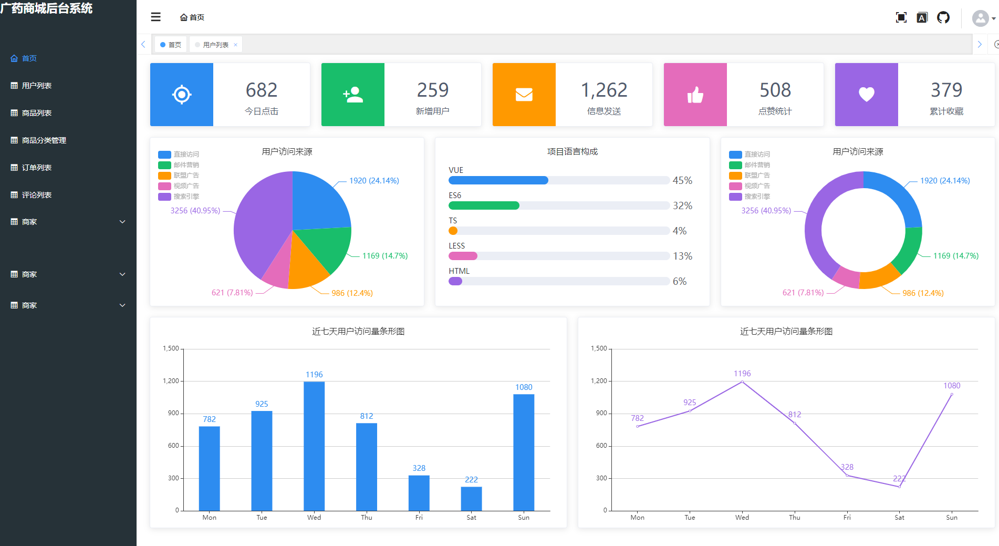
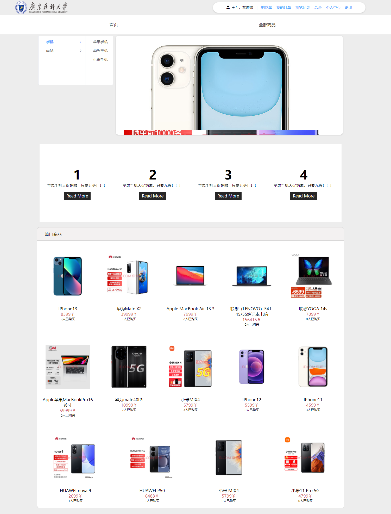

# 广药商城项目

# 1. 前言

*gdpushop* 项目是广东药科大学192计算机科学与技术软件工程课程，完成的课程大作业。仅用于学习使用。

商品图片、图标等来自京东，如有侵权请联系我删除。

# 2. 项目介绍

*gdpushop* 项目是一套电商系统，包括前台系统和后台管理系统，基于Springboot+MyBatisPlus实现，前端采用Vue框架。

* 前台商城系统包含首页、商品推荐与广告、商品搜索、商品展示、购物车、订单与支付流程、用户收货地址管理、用户历史浏览记录、用户个人中心等模块。
* 后台管理系统包含商品管理，订单管理，会员管理，统计报表、商家管理、商家与商品管理等模块。

## 2.1 项目演示

* **后台管理系统**
  
* **前台商城系统**

## 2.2 组织结构

> 暂时是单体架构，后面有时间再进行微服务拆分
>

gdpu

* config
* controller
  * AdvertisementController
  * CartController
  * CartOrderController
  * CategoryController
  * CommentInfoController
  * GoodsController
  * GoodsOrderController
  * OrderInfoController
  * UserController
* entity
* interceptors
* listener
* mapper
* service
* utils

## 2.3 技术选型

### 2.3.1 后端技术

| 技术                    | 说明                | 官网                                                                                                                                                                         |
| ----------------------- | ------------------- | ---------------------------------------------------------------------------------------------------------------------------------------------------------------------------- |
| SpringBoot              | 容器+MVC框架        | [https://spring.io/projects/spring-boot](https://spring.io/projects/spring-boot)                                                                                             |
| MyBatisPlus及代码生成器  | ORM框架              | [https://mp.baomidou.com/](https://github.com/jwtk/jjwt)                                                                                                                      |
| Druid                   | 数据库连接池        | [https://github.com/alibaba/druid](https://github.com/alibaba/druid)                                                                                                         |
| OSS                     | 对象存储            | [https://github.com/aliyun/aliyun-oss-java-sdk](https://github.com/aliyun/aliyun-oss-java-sdk)                                                                               |
| JWT                     | JWT登录支持         | [https://github.com/jwtk/jjwt](https://github.com/jwtk/jjwt)                                                                                                                 |
| Lombok                  | 简化对象封装工具    | [https://github.com/rzwitserloot/lombok](https://github.com/rzwitserloot/lombok)                                                                                             |
| Hutool                  | Java工具类库        | [https://github.com/looly/hutool](https://github.com/looly/hutool)                                                                                                           |
| Swagger-UI               | 文档生成工具        | [https://github.com/swagger-api/swagger-ui](https://github.com/swagger-api/swagger-ui)                                                                                       |
| Easyexcel                | 读写Excel的开源项目 | [https://alibaba-easyexcel.github.io/](https://alibaba-easyexcel.github.io/)                                                                                                 |
| Spring Data Redis       | Spring集成Redis     | [https://docs.spring.io/spring-data/data-redis/docs/current/reference/html/#reference](https://docs.spring.io/spring-data/data-redis/docs/current/reference/html/#reference) |

### 2.3.2 前端技术

| 技术       | 说明             | 选型                                                                             |
| ---------- | ---------------- | -------------------------------------------------------------------------------- |
| Vue        | 前端框架         | [https://vuejs.org/](https://vuejs.org/)                                         |
| Vue-router | 路由框架         | [https://router.vuejs.org/](https://router.vuejs.org/)                           |
| VueX       | 全局状态管理框架 | [https://vuex.vuejs.org/](https://vuex.vuejs.org/)                               |
| Element    | 前端UI框架       | [https://element.eleme.io](https://element.eleme.io/)                            |
| Axios      | 前端HTTP框架     | [https://github.com/axios/axios](https://github.com/axios/axios)                 |
| Js-cookie  | cookie管理工具   | [https://github.com/js-cookie/js-cookie](https://github.com/js-cookie/js-cookie) |

后台管理系统采用vue-admin-design框架 [VUE-admin-design](https://github.com/baimingxuan/vue-admin-design)

## 2.4 架构图

### 2.4.1 系统架构图

### 2.4.2 业务架构图

### 2.4.3 模块介绍

#### 1. 后台管理系统

#### 2. 前台商城系统

## 2.5 开发进度

# 3.环境搭建

## 3.1 开发环境

| 工具       | 版本   |
| ---------- | ------ |
| JDK        | 1.8    |
| Mysql      | 5.5    |
| SpringBoot | 2.5.5  |
| druid      | 1.1.12 |
| JWT        | 3.18.2 |
| easyexcel  | 2.1.1  |
| redis      | 2.8.9  |

## 3.2 搭建步骤

> windows环境部署后端
>

1. 导入gdpushop.sql文件
2. 修改application.yml文件，修改后端端口号，修改数据库用户名密码、IP地址、redis服务器地址
3. 启动

> 部署前端
>

1. npm install
2. npm run dev / npm run serve
